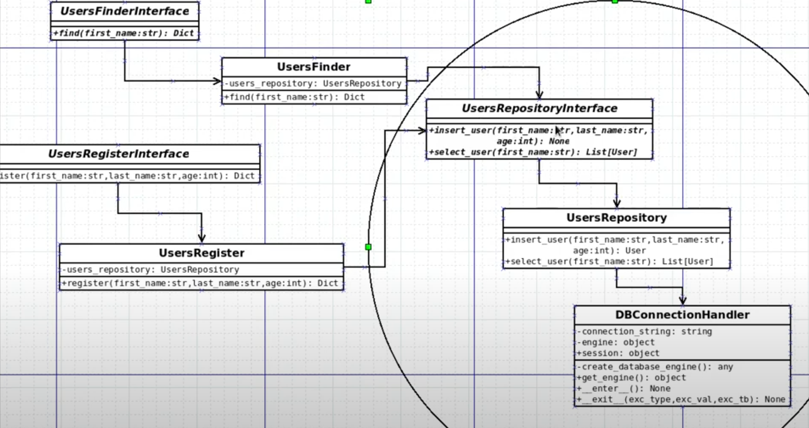

# Clean Architecture

Referência:  
https://www.youtube.com/watch?v=2nvbgwFE_0Y&list=PLAgbpJQADBGK0opZ8ZuDX3zDjQck_QKMy&index=1


**Clean Architecture** é uma arquitetura de software proposta por Robert Cecil Martin (ou Uncle Bob, como é mais conhecido) que tem por objetivo padronizar e organizar o código desenvolvido, favorecer a sua reusabilidade, assim como independência de tecnologia.

Por mais que a Clean Architecture foi criada em meados de 2012, está repleta de princípios atemporais que podem ser aplicados independente da tecnologia utilizada e linguagem de programação.

Exemplo: Mudar do Django para o FastAPI com facilidade, ou trocar o ORM.

Isto é conseguido não permitindo que o dado puro gerado por uma camada externa, seja recebido AS IS para uma camada interna, exemplo: o BODY HTML de uma requisição capturado pelo framework como FastAPI ser passado para a camada de Casos de Uso. Não queremos que nada de um círculo externo interfire no círculo interno.

## Princípios e domínio

Clean Architeture é sobre princípios, o próprio livro do Uncle Bob não foca em mostrar códigos de qualquer linguagem (tem apenas "piceladas").  
O foco é fazer o código centralizando o domínio do projeto, ou seja, funcionalidades e como os dados são tratados em vez de frameworks.  
Para facilitar domínio do projeto é tudo que você explica sobre o sistema para alguém que não conhece programação, ou seja, o que ele faz. Isso é de fato a utilidade dele e de ser protegido pelo clean architecture.  

## Entidades (Enterprise Business Rules)

As entidades encapsulam as regras de negócios de toda a empresa. Uma entidade pode ser um objeto com métodos ou pode ser um conjunto de funções e estruturas de dados.  
Ex: user_finder.py encapsula o model Users

## Use Cases (Application Business Rules)

Camada com as regras de negócio, orquestra o fluxo de data entre as entidades.  
Com clean architecture não se espera alterações nessa camada devido mudanças de databases, UI ou coisas parecidas.

## Implementation

Vamos implementar na prática em um projeto python utilizando SQLAlchemy, as ligações serão feitas via interface para a regra de negócio:



### Interface HTTP

Na sequência é implementada a camada HTTP do projeto.


### Install

```
docker rm -f clean_architecture_mysql
docker run --name clean_architecture_mysql -e MYSQL_ROOT_PASSWORD=root -p 3306:3306 -d mysql:8.0.37-debian
```

### Run

```
docker restart clean_architecture_mysql
source venv/bin/activate
pytest -s -v
```